# scaleASAP Database Architecture

This document describes the current database schema for the scaleASAP NestJS backend. The architecture supports two major data flows:

1. **Data Enrichment Pipeline**: Raw data from external sources (LinkedIn, manual uploads) flows through connectors, normalizers, enrichers, and reducers to produce versioned claims about people.
2. **Outreach Campaign Pipeline**: Discovery conversations generate ICPs → Experiments → Campaigns → Leads → OutreachMessages for automated B2B outreach.

**Key Design Principles:**
- **Global Person Identity**: Persons are uniquely identified by their LinkedIn URL across the entire database (not project-scoped). The same person can be associated with multiple projects via `PersonProjects`.
- **Project Scoping via PersonProjects**: All project-person associations are defined exclusively through the `PersonProjects` junction table.
- **Campaign-Lead Hierarchy**: Campaigns contain Leads; Leads can optionally link to global Person records for enrichment data.
- **Module Scope**: Modules operate at either `PERSON_LEVEL` (per-person analysis) or `PROJECT_LEVEL` (batch operations affecting the entire project).
- **PascalCase Naming**: All tables use PascalCase column naming.
- **UTC Timestamps**: All temporal fields use `timestamp with time zone` and store UTC values.

## Table of Contents

- [Entity Relationship Diagram](#entity-relationship-diagram)
- [Outreach Pipeline Entities](#outreach-pipeline-entities)
- [Enum Catalog](#enum-catalog)
- [Core Data Flow](#core-data-flow)
- [Outreach Campaign Flow](#outreach-campaign-flow)
- [Time & Timezone Rules](#time--timezone-rules)
- [Repository Service Conventions](#repository-service-conventions)

---

## Entity Relationship Diagram

```mermaid
erDiagram
    Companies ||--o{ Users : "has"
    Companies ||--o{ Projects : "has"
    Users ||--o{ ProjectUsers : "assigned to"
    Users ||--o{ PersonProjects : "creates"
    Users ||--o{ ModuleRuns : "triggers"
    Projects ||--o{ ProjectUsers : "has access"
    Projects ||--o{ PersonProjects : "tracks"
    Projects ||--o{ ModuleRuns : "executes"
    Projects ||--o{ Documents : "stores"
    Projects ||--o{ PostItems : "contains"
    Projects ||--o{ ContentChunks : "groups"
    Projects ||--o{ Claims : "produces"
    Projects ||--o{ LayerSnapshots : "compiles"
    Projects ||--o{ Experiments : "has"
    Projects ||--o{ Campaigns : "has"
    Projects ||--o{ Leads : "has"
    Projects ||--o{ DiscoverySessions : "has"
    Persons ||--o{ PersonProjects : "associated via"
    Persons ||--o{ ModuleRuns : "analyzed by"
    Persons ||--o{ Documents : "data about"
    Persons ||--o{ PostItems : "authored"
    Persons ||--o{ ContentChunks : "content from"
    Persons ||--o{ Claims : "facts about"
    Persons ||--o{ LayerSnapshots : "profile of"
    Persons ||--o{ Leads : "linked to"
    Experiments ||--o{ Campaigns : "generates"
    Campaigns ||--o{ Leads : "contains"
    Campaigns ||--o{ CampaignActivities : "logs"
    Campaigns ||--o{ OutreachMessages : "sends"
    Leads ||--o{ OutreachMessages : "receives"
    Leads ||--o{ GeneratedMessages : "has"
    ModuleRuns ||--o{ Documents : "produces"
    ModuleRuns ||--o{ Claims : "generates"
    ModuleRuns ||--o{ LayerSnapshots : "creates"
    ModuleRuns ||--o{ DiscoveryRunItems : "discovers"
    Documents ||--o{ PostItems : "normalized into"
    Documents ||--o{ Claims : "source of"
    PostItems ||--o{ ContentChunkItems : "grouped by"
    ContentChunks ||--o{ ContentChunkItems : "contains"
    ContentChunks ||--o| ChunkEvidences : "analyzed into"
    Claims ||--o{ Claims : "supersedes"
    DiscoveryRunItems ||--o| Documents : "creates"
    DiscoveryRunItems }o--|| Persons : "discovered"

    Companies {
        int CompanyID PK
        varchar Name
        varchar Slug UK
        timestamptz CreatedAt
        timestamptz UpdatedAt
    }

    Users {
        int UserID PK
        bigint CompanyID FK
        varchar Email UK
        varchar Name
        varchar PasswordHash
        enum Role
        enum Status
        timestamptz CreatedAt
        timestamptz UpdatedAt
    }

    Projects {
        int ProjectID PK
        bigint CompanyID FK
        varchar Name
        enum Status
        timestamptz CreatedAt
        timestamptz UpdatedAt
    }

    Persons {
        int PersonID PK
        varchar LinkedinUrl UK "Global unique identifier"
        varchar PrimaryDisplayName
        enum Status
        bigint CreatedByUserID FK
        timestamptz CreatedAt
        timestamptz UpdatedAt
    }

    ProjectUsers {
        int ProjectUserID PK
        bigint ProjectID FK
        bigint UserID FK
        enum ProjectRole
        timestamptz CreatedAt
        timestamptz UpdatedAt
    }

    PersonProjects {
        int PersonProjectID PK
        bigint PersonID FK
        bigint ProjectID FK "UNIQUE(ProjectID,PersonID)"
        varchar Tag
        bigint CreatedByUserID FK
        timestamptz CreatedAt
        timestamptz UpdatedAt
    }

    Modules {
        int ModuleID PK
        varchar ModuleKey
        enum ModuleType
        enum Scope "PERSON_LEVEL or PROJECT_LEVEL"
        varchar Version
        jsonb ConfigSchemaJson
        boolean IsEnabled
        timestamptz CreatedAt
        timestamptz UpdatedAt
    }

    ModuleRuns {
        int ModuleRunID PK
        bigint ProjectID FK
        bigint PersonID FK "nullable for PROJECT_LEVEL"
        bigint TriggeredByUserID FK
        varchar ModuleKey
        varchar ModuleVersion
        enum Status
        jsonb InputConfigJson
        timestamptz StartedAt
        timestamptz FinishedAt
        jsonb ErrorJson
        timestamptz CreatedAt
        timestamptz UpdatedAt
    }

    Documents {
        int DocumentID PK
        bigint ProjectID FK
        bigint PersonID FK "nullable for project-level docs"
        varchar Source
        varchar SourceRef
        varchar ContentType
        varchar DocumentKind
        boolean IsValid
        text StorageUri
        varchar Hash
        timestamptz CapturedAt
        bigint ModuleRunID FK
        jsonb PayloadJson
        jsonb InvalidatedMetaJson
        timestamptz CreatedAt
        timestamptz UpdatedAt
    }

    PostItems {
        int PostItemID PK
        bigint ProjectID FK
        bigint PersonID FK
        bigint SourceDocumentID FK
        enum Source
        varchar PlatformPostID
        text Permalink
        timestamptz PostedAt
        text Text
        jsonb MediaUrlsJson
        jsonb EngagementJson
        varchar Fingerprint UK
        boolean IsValid
        timestamptz CreatedAt
        timestamptz UpdatedAt
    }

    ContentChunks {
        int ContentChunkID PK
        bigint ProjectID FK
        bigint PersonID FK
        enum Source
        enum ChunkType
        timestamptz FromAt
        timestamptz ToAt
        int PostCount
        varchar Fingerprint UK
        enum Status
        boolean IsValid
        timestamptz CreatedAt
        timestamptz UpdatedAt
    }

    ContentChunkItems {
        int ContentChunkItemID PK
        bigint ContentChunkID FK
        bigint PostItemID FK
        timestamptz CreatedAt
        timestamptz UpdatedAt
    }

    ChunkEvidences {
        int ChunkEvidenceID PK
        bigint ContentChunkID FK "UNIQUE"
        jsonb EvidenceJson
        enum AIProvider
        varchar AIModel
        int TokensUsed
        enum Status
        jsonb ErrorJson
        timestamptz CreatedAt
        timestamptz UpdatedAt
    }

    Claims {
        int ClaimID PK
        bigint ProjectID FK
        bigint PersonID FK
        varchar ClaimType
        varchar GroupKey
        jsonb ValueJson
        double Confidence
        timestamptz ObservedAt
        timestamptz ValidFrom
        timestamptz ValidTo
        timestamptz SupersededAt
        bigint ReplacedByClaimID FK
        bigint SourceDocumentID FK
        bigint ModuleRunID FK
        varchar SchemaVersion
        timestamptz CreatedAt
        timestamptz UpdatedAt
    }

    LayerSnapshots {
        int LayerSnapshotID PK
        bigint ProjectID FK
        bigint PersonID FK
        int LayerNumber
        int SnapshotVersion
        varchar ComposerModuleKey
        varchar ComposerVersion
        jsonb CompiledJson
        timestamptz GeneratedAt
        bigint ModuleRunID FK
        timestamptz CreatedAt
        timestamptz UpdatedAt
    }

    DiscoveryRunItems {
        int DiscoveryRunItemID PK
        bigint ModuleRunID FK
        bigint ProjectID FK
        bigint PersonID FK "nullable if failed"
        varchar SourceRef "external ID"
        bigint CreatedDocumentID FK "nullable if failed"
        enum Status "CREATED or FAILED"
        jsonb ErrorJson "nullable"
        timestamptz CreatedAt
        timestamptz UpdatedAt
    }

    Experiments {
        int ExperimentID PK
        bigint ProjectID FK
        varchar Name
        enum Type "BULLSEYE, VARIABLE_A, VARIABLE_B, etc."
        text Pattern "ICP pattern description"
        jsonb Industries "target industries"
        text Pain "pain point"
        text Trigger "trigger event"
        jsonb WizaFilters "search filters"
        text OutreachAngle
        enum Status "PENDING through COMPLETE"
        int LeadsFound
        int LeadsWarming
        int MeetingsBooked
        timestamptz CreatedAt
        timestamptz UpdatedAt
    }

    Campaigns {
        int CampaignID PK
        bigint ProjectID FK
        bigint ExperimentID FK "nullable"
        varchar Name
        enum Status "ACTIVE, PAUSED, etc."
        jsonb Settings
        int DailyLeadLimit
        boolean AutopilotEnabled
        timestamptz LastDiscoveryRun
        timestamptz NextDiscoveryRun
        timestamptz CreatedAt
        timestamptz UpdatedAt
        timestamptz DeletedAt "soft delete"
    }

    Leads {
        int LeadID PK
        bigint CampaignID FK
        bigint ProjectID FK
        bigint PersonID FK "optional link to Person"
        varchar FullName
        varchar JobTitle
        varchar Company
        varchar LinkedinUrl
        varchar Email
        varchar Phone
        varchar Location
        varchar AvatarUrl
        text AiSummary
        int RelevanceScore
        enum Status "FOUND through RESPONDED"
        enum Outcome "NO_RESPONSE, INTERESTED, etc."
        text OutcomeReason
        jsonb RawData
        jsonb EnrichmentData
        text OutboundMessage
        timestamptz ContactedAt
        timestamptz RespondedAt
        timestamptz CreatedAt
        timestamptz UpdatedAt
    }

    DiscoverySessions {
        int DiscoverySessionID PK
        bigint ProjectID FK
        jsonb Messages "chat history"
        jsonb GeneratedIcps
        enum Status "ACTIVE, COMPLETED, ABANDONED"
        timestamptz CreatedAt
        timestamptz UpdatedAt
    }

    OutreachMessages {
        int OutreachMessageID PK
        bigint LeadID FK
        bigint CampaignID FK
        enum Format "LINKEDIN_CONNECTION, EMAIL_COLD, etc."
        boolean IsFollowup
        int SequenceNumber
        text Content
        varchar Subject
        enum Status "DRAFT through REPLIED"
        timestamptz ScheduledAt
        timestamptz SentAt
        timestamptz OpenedAt
        timestamptz RepliedAt
        timestamptz CreatedAt
        timestamptz UpdatedAt
    }

    GeneratedMessages {
        int GeneratedMessageID PK
        bigint LeadID FK
        enum Platform "LINKEDIN, EMAIL"
        enum MessageType "CONNECTION_REQUEST, FOLLOW_UP_DM, EMAIL_COLD, EMAIL_FOLLOW_UP"
        text MessageContent
        varchar Subject "nullable, for emails"
        text PersonalizationNote
        boolean IsUsed
        int Rating "nullable, 1-5"
        timestamptz CreatedAt
        timestamptz UpdatedAt
    }

    CampaignActivities {
        int CampaignActivityID PK
        bigint CampaignID FK
        enum ActivityType
        varchar Title
        text Description
        jsonb Metadata
        varchar Status
        timestamptz CreatedAt
    }
```



**Key Indexes:**
- `Persons`: UNIQUE IDX_PERSON_LINKEDIN_URL on (LinkedinUrl) — **global unique identifier**
- `PersonProjects`: UNIQUE UQ_PERSON_PROJECT on (ProjectID, PersonID) — **prevents duplicate associations**
- `Documents`: IDX_DOCUMENT_LATEST_VALID on (ProjectID, PersonID, Source, DocumentKind, IsValid, CapturedAt)
- `PostItems`: UNIQUE (ProjectID, PersonID, Fingerprint)
- `ContentChunks`: UNIQUE (ProjectID, PersonID, Fingerprint)
- `ContentChunkItems`: UNIQUE (ContentChunkID, PostItemID)
- `ChunkEvidences`: UNIQUE (ContentChunkID) — one evidence per chunk
- `Projects`: Index on (CompanyID, Status)
- `ModuleRuns`: Index on (ProjectID, PersonID, CreatedAt)
- `Claims`: Index on (ProjectID, PersonID, ClaimType, GroupKey, CreatedAt)
- `DiscoveryRunItems`: Index on (ModuleRunID, ProjectID) and (ProjectID, PersonID)
- `Experiments`: Index on (ProjectID) and (ProjectID, Status)
- `Campaigns`: Index on (ProjectID), (ExperimentID), and (ProjectID, Status)
- `Leads`: Index on (CampaignID), (ProjectID), (ProjectID, Status), and (LinkedinUrl)
- `DiscoverySessions`: Index on (ProjectID)
- `OutreachMessages`: Index on (LeadID) and (CampaignID)
- `CampaignActivities`: Index on (CampaignID, CreatedAt)

---

## Outreach Pipeline Entities

The outreach pipeline introduces six new entities for B2B lead generation and campaign management:

### DiscoverySessions
Stores AI-powered discovery conversation sessions where users describe their ICP (Ideal Customer Profile).

**Purpose:**
- Capture chat history between user and AI discovery assistant
- Store generated ICPs/experiments from each session
- Support iterative refinement of targeting criteria

**Key Fields:**
- `Messages` (jsonb): Array of chat messages with role (user/assistant) and content
- `GeneratedIcps` (jsonb): Array of ICP objects generated from the conversation
- `Status`: ACTIVE (in progress), COMPLETED (ICPs generated), ABANDONED (user left)

### Experiments
Represents an ICP hypothesis generated from discovery sessions.

**Purpose:**
- Store ICP targeting criteria (industries, pain points, triggers)
- Track performance metrics (leads found, meetings booked)
- Configure Wiza search filters for lead discovery

**Key Fields:**
- `Type`: BULLSEYE (highest confidence), VARIABLE_A/B, CONTRARIAN, LONG_SHOT
- `Pattern`: Human-readable ICP description
- `WizaFilters` (jsonb): Search parameters for Wiza API
- `OutreachAngle`: Suggested messaging approach for this ICP
- `Status`: PENDING → CREATING_HYPOTHESES → FINDING_LEADS → WARMUP_INITIATED → COMPLETE

### Campaigns
Represents an outreach campaign targeting leads from an experiment.

**Purpose:**
- Group leads for coordinated outreach
- Manage autopilot settings and daily limits
- Track discovery run schedules

**Key Fields:**
- `ExperimentID`: Link to source experiment (nullable for manual campaigns)
- `DailyLeadLimit`: Max leads to process per day (default: 50)
- `AutopilotEnabled`: Enable automatic outreach
- `Settings` (jsonb): Campaign-specific configuration
- `DeletedAt`: Soft delete support

### Leads
Individual prospect records within a campaign.

**Purpose:**
- Store contact information and enrichment data
- Track outreach status and outcomes
- Optionally link to global Person for enrichment

**Key Fields:**
- `PersonID` (nullable): Optional link to global Person record for enrichment data
- `RelevanceScore`: AI-calculated fit score (0-100)
- `Status`: FOUND → ENRICHING → ENRICHED → DRAFTED → QUEUED → SENT → RESPONDED
- `Outcome`: NO_RESPONSE, INTERESTED, MEETING_BOOKED, CLOSED_WON, etc.
- `EnrichmentData` (jsonb): Wiza/third-party enrichment data
- `OutboundMessage`: Generated personalized message

### OutreachMessages
Individual messages sent to leads.

**Purpose:**
- Store message content and delivery status
- Support multi-step sequences with followups
- Track engagement (opens, clicks, replies)

**Key Fields:**
- `Format`: LINKEDIN_CONNECTION, LINKEDIN_MESSAGE, EMAIL_COLD, etc.
- `IsFollowup`: Whether this is a followup message
- `SequenceNumber`: Position in outreach sequence
- `Status`: DRAFT → SCHEDULED → SENT → DELIVERED → OPENED → REPLIED

### CampaignActivities
Activity log for campaign events.

**Purpose:**
- Provide audit trail of campaign actions
- Support activity feed UI
- Track errors and status changes

**Key Fields:**
- `ActivityType`: CAMPAIGN_CREATED, LEADS_FOUND, LEAD_CONTACTED, MEETING_BOOKED, etc.
- `Metadata` (jsonb): Event-specific data (lead count, error details)

---

## Enum Catalog

### EntityStatus
**Values**: ACTIVE, INACTIVE, ARCHIVED  
**Used in**:
- User.Status
- Person.Status

### UserRole
**Values**: ADMIN, MEMBER, VIEWER  
**Used in**:
- User.Role

### ProjectUserRole
**Values**: OWNER, ADMIN, MEMBER, VIEWER  
**Used in**:
- ProjectUser.ProjectRole

### ProjectStatus
**Values**: ACTIVE, ARCHIVED, DELETED  
**Used in**:
- Project.Status

### ModuleType
**Values**: CONNECTOR, ENRICHER, COMPOSER  
**Used in**:
- Module.ModuleType

### ModuleScope
**Values**: PERSON_LEVEL, PROJECT_LEVEL  
**Used in**:
- Module.Scope

**Scope Semantics:**
- **PERSON_LEVEL**: Module operates on a single person. ModuleRun requires PersonID and validates PersonProjects association.
- **PROJECT_LEVEL**: Module operates at project level (batch operations). ModuleRun has PersonID = null.

### ModuleRunStatus
**Values**: QUEUED, RUNNING, COMPLETED, FAILED, CANCELLED  
**Used in**:
- ModuleRun.Status

### DiscoveryRunItemStatus
**Values**: CREATED, FAILED  
**Used in**:
- DiscoveryRunItem.Status

### DATA_SOURCE
**Values**: LINKEDIN, X, TWITTER, GITHUB, BLOG, OTHER  
**Used in**:
- PostItem.Source
- ContentChunk.Source

### CHUNK_TYPE
**Values**: MONTHLY, BATCH  
**Used in**:
- ContentChunk.ChunkType

### CHUNK_STATUS
**Values**: CREATED, POPULATED, EVIDENCE_READY  
**Used in**:
- ContentChunk.Status

### EVIDENCE_STATUS
**Values**: CREATED, COMPLETED, FAILED  
**Used in**:
- ChunkEvidence.Status

### AI_PROVIDER
**Values**: OPENAI  
**Used in**:
- ChunkEvidence.AIProvider

### AI_MODEL
**Values**: gpt-4o, gpt-4o-mini  
**Used in**: AI service configuration (not directly in entity columns)

### AI_TASK
**Values**: AGE_RANGE_ESTIMATION, ALIAS_INFERENCE, TEXT_SUMMARIZATION, ENTITY_EXTRACTION, EMAIL_PATTERN_INFERENCE, PROFILE_PHOTO_CONFIDENCE_SIGNAL, BIO_EVOLUTION_ANALYSIS, DOMAIN_OWNERSHIP_INFERENCE, POSTS_CHUNK_EVIDENCE_EXTRACTION  
**Used in**: AI service configuration (not directly in entity columns)

### CLAIM_KEY (and ClaimType)
**Values**:
- core_identity.legal_name
- core_identity.location
- core_identity.education_item
- core_identity.career_role
- core_identity.certification
- core_identity.board_position
- core_identity.age_range
- digital_identity.email_pattern
- digital_identity.profile_photo_signal
- digital_identity.bio_evolution
- digital_identity.domain_ownership
- personality.active_times

**Used in**:
- Claim.ClaimType

### DocumentSource
**Values**: MANUAL, LINKEDIN, PROSPECT, RESUME, GITHUB, WEB  
**Used in**:
- Document.Source (as string, not enforced enum in entity)

### DocumentKind
**Values**: linkedin_profile, linkedin_posts, prospect_search_results, prospect_person_snapshot  
**Used in**:
- Document.DocumentKind (as string, not enforced enum in entity)

**DocumentKind Semantics:**
- `linkedin_profile`: LinkedIn profile data (person-level)
- `linkedin_posts`: LinkedIn posts data (person-level)
- `prospect_search_results`: Batch search results from Prospect.io (project-level, PersonID=null)
- `prospect_person_snapshot`: Per-person data extracted from prospect search (person-level)

---

### Outreach Pipeline Enums

### ExperimentType
**Values**: BULLSEYE, VARIABLE_A, VARIABLE_B, CONTRARIAN, LONG_SHOT  
**Used in**:
- Experiment.Type

**Semantics:**
- `BULLSEYE`: Highest-confidence ICP based on discovery conversation
- `VARIABLE_A/B`: Alternative hypotheses to test
- `CONTRARIAN`: Counter-intuitive targeting angle
- `LONG_SHOT`: Lower-confidence, high-potential ICP

### ExperimentStatus
**Values**: PENDING, CREATING_HYPOTHESES, FINDING_LEADS, PRIORITIZING_LEADS, WARMUP_INITIATED, COMPLETE, FAILED  
**Used in**:
- Experiment.Status

### CampaignStatus
**Values**: ACTIVE, PAUSED, COMPLETED, ARCHIVED  
**Used in**:
- Campaign.Status

### LeadStatus
**Values**: FOUND, ENRICHING, ENRICHED, DRAFTED, QUEUED, SENT, RESPONDED  
**Used in**:
- Lead.Status

**Lead Lifecycle:**
1. `FOUND`: Lead discovered from Wiza/search
2. `ENRICHING`: Enrichment in progress
3. `ENRICHED`: Enrichment data received
4. `DRAFTED`: Outreach message generated
5. `QUEUED`: Ready to send
6. `SENT`: Message sent
7. `RESPONDED`: Lead replied

### LeadOutcome
**Values**: NO_RESPONSE, INTERESTED, MEETING_BOOKED, MEETING_DONE, CLOSED_WON, CLOSED_LOST, REJECTED, UNQUALIFIED  
**Used in**:
- Lead.Outcome

### OutreachFormat
**Values**: LINKEDIN_CONNECTION, LINKEDIN_MESSAGE, LINKEDIN_INMAIL, EMAIL_COLD, EMAIL_WARM  
**Used in**:
- OutreachMessage.Format

### OutreachStatus
**Values**: DRAFT, SCHEDULED, SENT, DELIVERED, OPENED, CLICKED, REPLIED, BOUNCED, FAILED  
**Used in**:
- OutreachMessage.Status

### DiscoverySessionStatus
**Values**: ACTIVE, COMPLETED, ABANDONED  
**Used in**:
- DiscoverySession.Status

### ActivityType
**Values**: CAMPAIGN_CREATED, DISCOVERY_STARTED, DISCOVERY_COMPLETED, LEADS_FOUND, LEADS_ENRICHED, OUTREACH_GENERATED, LEAD_CONTACTED, LEAD_RESPONDED, MEETING_BOOKED, CAMPAIGN_PAUSED, CAMPAIGN_RESUMED, ERROR_OCCURRED  
**Used in**:
- CampaignActivity.ActivityType

### SignalType
**Values**: FUNDING, HIRING, EXPANSION, PRODUCT_LAUNCH, PARTNERSHIP, LEADERSHIP_CHANGE, NEWS_MENTION, SOCIAL_ACTIVITY  
**Used in**:
- Lead enrichment signals (stored in EnrichmentData jsonb)

---

## Core Data Flow

The scaleASAP system implements a modular data enrichment pipeline with the following stages:

### 0. Person & Project Setup (Pre-requisite)
- **Person is Global**: A Person is uniquely identified by their `LinkedinUrl` across all projects
- **Get-or-Create Pattern**: When adding a person, use `getOrCreateByLinkedinUrl(linkedinUrl, userId, displayName?)`
  - If a Person with that normalized LinkedIn URL exists → return existing Person
  - Otherwise → create new Person record
- **Project Association**: Add Person to Project via `PersonProjects`:
  - `PersonProjects(ProjectID, PersonID)` has UNIQUE constraint
  - Same person cannot be added twice to the same project
- **Validation**: Creating a PERSON_LEVEL ModuleRun requires the Person to be associated with the Project via PersonProjects

### 1. Module Run Initialization
- User creates a ModuleRun via API (protected by AdminAuthGuard)
- **Two API paths based on Module.Scope**:
  - `POST /projects/:projectId/persons/:personId/runs` — PERSON_LEVEL modules
  - `POST /projects/:projectId/modules/run` — PROJECT_LEVEL modules
- **PERSON_LEVEL Validation**: Person must be associated with Project via PersonProjects
- **PROJECT_LEVEL Validation**: Module.Scope must be PROJECT_LEVEL; PersonID is set to null
- ModuleRun is inserted with Status=QUEUED, assigned to a Project + Person
- ModuleRun.InputConfigJson contains module-specific parameters

### 2. Indexer & Dispatcher
- Background indexer polls ModuleRuns table for QUEUED runs
- Dispatcher routes run to appropriate handler based on ModuleKey
- ModuleRun.Status transitions: QUEUED → RUNNING → COMPLETED/FAILED
- StartedAt and FinishedAt timestamps track execution

### 3. Connector Phase (ModuleType=CONNECTOR)
- Connectors fetch raw data from external sources (LinkedIn, manual uploads, Prospect.io)
- Data is stored in Documents table with:
  - IsValid=true for active version
  - CapturedAt timestamp for ordering
  - PayloadJson contains raw JSON payload
  - Hash for deduplication
- When newer data arrives, old document gets IsValid=false
- Query for latest valid: `WHERE IsValid=true ORDER BY CapturedAt DESC`

**Connector Scope Variations:**
- **PERSON_LEVEL connectors** (e.g., linkedin-profile-connector): Store Documents with PersonID set
- **PROJECT_LEVEL connectors** (e.g., prospect-search-connector): Store Documents with PersonID=null

### 3a. Prospect Search Flow (PROJECT_LEVEL)
This is a specialized connector flow for batch prospect discovery:

1. **Run PROJECT_LEVEL Module**: `POST /projects/:projectId/modules/run`
   - ModuleKey: `prospect-search-connector`
   - InputConfigJson: search filters, maxPages, maxItems

2. **Store Batch Results**: Creates one Document:
   - DocumentKind: `prospect_search_results`
   - PersonID: null (project-level)
   - PayloadJson: full search response with all items

3. **Fan-out Phase** (ProspectFanoutService):
   - Parse `prospect_search_results` document
   - For each item with valid LinkedIn URL:
     - Get-or-create Person by LinkedIn URL (globally unique)
     - Ensure PersonProjects association (idempotent)
     - Create per-person Document (DocumentKind: `prospect_person_snapshot`)
     - Create DiscoveryRunItem for lineage tracking
   - Handle partial failures (one failure doesn't abort entire batch)

4. **Lineage Tracking** (DiscoveryRunItems):
   - One row per processed prospect
   - Status: CREATED (success) or FAILED (error)
   - ErrorJson captures failure details
   - Links ModuleRunID → PersonID → CreatedDocumentID

### 4. Normalizer Phase
- Normalizers parse Documents and extract structured items
- Example: linkedin-posts-normalizer creates PostItems from linkedin_posts Document
- PostItems have unique Fingerprint (SHA256 hash) per Project/Person
- Idempotent: re-running normalizer skips existing Fingerprints

### 5. Chunking Phase (ModuleType=ENRICHER)
- ContentChunker groups PostItems into temporal batches
- CHUNK_TYPE.MONTHLY: groups by UTC month (e.g., "2024-01")
- CHUNK_TYPE.BATCH: all dated posts in one chunk
- ContentChunkItems join table links posts to chunks
- Chunk boundaries (FromAt, ToAt) use UTC timestamps

### 6. Evidence Extraction Phase (ModuleType=ENRICHER)
- AI extractors process each ContentChunk
- One AI call per chunk (no batching)
- Results stored in ChunkEvidence.EvidenceJson
- Status: CREATED → COMPLETED/FAILED
- ErrorJson captures failures
- Metadata: AIProvider, AIModel, TokensUsed

### 7. Reducer Phase (ModuleType=ENRICHER)
- Reducers aggregate ChunkEvidence across multiple chunks
- Produce Claim records with:
  - ClaimType (e.g., 'personality.active_times')
  - ValueJson (structured claim value + metadata)
  - Confidence score
  - SourceDocumentID (latest valid LINKEDIN_POSTS document)

### 8. Claim Versioning
- Claims support versioning via SupersededAt mechanism:
  - Active claims: SupersededAt=NULL
  - Superseded claims: SupersededAt set, ReplacedByClaimID points to new version
- GroupKey identifies which claims supersede each other:
  - 'single' for singleton claims (e.g., legal name)
  - Unique ID for multi-value claims (e.g., education_item_{uuid})
- Query for active claims: `WHERE SupersededAt IS NULL`

### 9. Composer Phase (ModuleType=COMPOSER)
- Composers compile Claims into LayerSnapshots
- LayerNumber indicates abstraction level (1, 2, 3...)
- SnapshotVersion increments with each compilation
- CompiledJson contains final profile representation

---

## Outreach Campaign Flow

The outreach pipeline implements an AI-powered B2B lead generation workflow:

### 1. Discovery Session
User initiates a discovery conversation to define their ICP:

```
User → DiscoverySession.Messages (chat)
     → AI generates ICPs
     → DiscoverySession.GeneratedIcps
     → User selects/refines ICPs
     → Experiments created
```

**API Flow:**
- `POST /workspaces/:id/discovery` — Start/continue discovery chat
- Discovery AI (DiscoveryAIService) orchestrates multi-turn conversation
- Session stores full chat history and generated ICPs

### 2. Experiment Creation
From a discovery session, experiments are created representing ICP hypotheses:

**Experiment Types:**
- **BULLSEYE**: Primary ICP with highest confidence
- **VARIABLE_A/B**: Alternative targeting angles
- **CONTRARIAN**: Counter-intuitive hypothesis
- **LONG_SHOT**: Lower confidence, high potential

**Status Progression:**
```
PENDING → CREATING_HYPOTHESES → FINDING_LEADS → PRIORITIZING_LEADS → WARMUP_INITIATED → COMPLETE
```

### 3. Campaign Creation
Campaigns are created from experiments (or standalone):

```
Experiment → Campaign
Campaign contains:
  - Settings (jsonb): Campaign-specific config
  - DailyLeadLimit: Max leads/day (default 50)
  - AutopilotEnabled: Auto-send outreach
  - Discovery run scheduling
```

**API:**
- `POST /workspaces/:id/campaigns` — Create campaign from experiment

### 4. Lead Discovery & Enrichment
Background jobs discover and enrich leads:

```
Campaign → DISCOVERY Queue → Wiza Search → Leads created
        → LEAD_ENRICHMENT Queue → Enrich contact data
        → Lead.Status: FOUND → ENRICHING → ENRICHED
```

**Lead Status Flow:**
1. `FOUND`: Discovered from Wiza/search results
2. `ENRICHING`: Enrichment job in progress
3. `ENRICHED`: Contact data enriched
4. `DRAFTED`: AI-generated outreach message
5. `QUEUED`: Ready to send
6. `SENT`: Message delivered
7. `RESPONDED`: Lead replied

### 5. Outreach Generation
AI generates personalized messages:

```
Lead + Experiment.OutreachAngle
    → OUTREACH Queue
    → OutreachAIService
    → OutreachMessage created
    → Lead.OutboundMessage populated
    → Lead.Status = DRAFTED
```

**Message Formats:**
- `LINKEDIN_CONNECTION`: Initial connection request
- `LINKEDIN_MESSAGE`: Direct message
- `LINKEDIN_INMAIL`: InMail (premium)
- `EMAIL_COLD`: Cold email
- `EMAIL_WARM`: Warm email (has relationship)

### 6. Message Delivery
Outreach messages are scheduled and sent:

```
OutreachMessage.Status:
  DRAFT → SCHEDULED → SENT → DELIVERED → OPENED → REPLIED

On send: Lead.ContactedAt = now()
On reply: Lead.RespondedAt = now(), Lead.Status = RESPONDED
```

### 7. Outcome Tracking
Leads are tracked through the funnel:

```
Lead.Outcome:
  NO_RESPONSE → INTERESTED → MEETING_BOOKED → MEETING_DONE → CLOSED_WON/LOST
            ↘ REJECTED
            ↘ UNQUALIFIED
```

**CampaignActivity logs all events:**
- CAMPAIGN_CREATED, DISCOVERY_STARTED, DISCOVERY_COMPLETED
- LEADS_FOUND, LEADS_ENRICHED, OUTREACH_GENERATED
- LEAD_CONTACTED, LEAD_RESPONDED, MEETING_BOOKED
- CAMPAIGN_PAUSED, CAMPAIGN_RESUMED, ERROR_OCCURRED

### 8. Person Linking (Optional)
Leads can optionally link to global Person records:

```
Lead.PersonID → Person.PersonID (nullable)

Benefits of linking:
- Access enrichment data from Person layer
- Cross-campaign deduplication
- Layer data (Claims, LayerSnapshots) available
```

If Lead.LinkedinUrl matches an existing Person, the Lead can be linked to leverage existing enrichment data.

---

## Async Job Queue Architecture

The system uses Bull queues backed by Redis for background processing:

### Queue Names
| Queue | Purpose |
|-------|---------|
| `DISCOVERY` | ICP discovery and lead search |
| `OUTREACH` | Message generation |
| `LEAD_ENRICHMENT` | Contact data enrichment |
| `WEBSITE_SCRAPER` | Company website scraping |
| `NEW_LOGS` | New log processing |
| `LATE_LOGS` | Retry failed logs |
| `MODULE_RUNS` | Module execution |

### Job Data Interface
All jobs carry standard metadata:
```typescript
interface BaseJobData {
  workspaceId: number;
  userId?: number;
  campaignId?: number;
  experimentId?: number;
  leadId?: number;
  correlationId: string;  // For tracing
  metadata?: Record<string, any>;
}
```

### Job Progress Tracking
Jobs report progress via Redis:
- `currentStep`: Current step name
- `totalSteps`: Total steps in job
- `progress`: Percentage (0-100)
- `status`: pending | processing | completed | failed

---

## Time & Timezone Rules

### UTC Enforcement
All time-based analytics in the scaleASAP system use **UTC** for consistent bucketing across timezones.

### Where UTC is Enforced:
- **Content Chunking**: Monthly chunks use UTC month boundaries via `getUtcMonth()` and `getUtcYear()` helpers
- **Time-of-Day Analytics**: Reducers extract hour-of-day using `getUTCHours()` (not `getHours()`)
- **Day-of-Week Analytics**: Use `getUTCDay()` (not `getDay()`)

### Storing UTC Metadata:
Claims that perform time bucketing MUST include UTC metadata in ValueJson:

```typescript
ValueJson: {
  // ... claim data ...
  _meta: {
    time: {
      basis: 'UTC',
      timezone: 'UTC'
    },
    // ... other metadata ...
  }
}
```

### Timestamp Storage:
- All `timestamp with time zone` columns store UTC instants
- PostItem.PostedAt: UTC timestamp representing when post was published
- ContentChunk.FromAt/ToAt: UTC chunk boundaries
- ModuleRun.StartedAt/FinishedAt: UTC execution times

### Helper Functions:
Time utilities are centralized in `src/common/helpers/time.ts`:
- `getUtcHour(date)` — extract hour 0-23 in UTC
- `getUtcDayOfWeek(date)` — extract day 0-6 in UTC
- `getUtcYear(date)`, `getUtcMonth(date)`, `getUtcDate(date)`
- `getUtcMonthStart(year, month)`, `getUtcMonthEnd(year, month)`
- `formatUtcYearMonth(date)` — format as 'YYYY-MM'

### Data Source Timestamps:
- LinkedIn `posted_at.timestamp` (milliseconds) is used as primary source
- `new Date(timestamp)` creates proper UTC Date object
- Analytics derive UTC buckets from these Date objects

---

## Repository Service Conventions

### CRUD-Only Pattern
All repository services in `src/repo/*-repo.service.ts` are **CRUD-only**:
- `get(options, panic)` — fetch single entity
- `getAll(options, panic)` — fetch multiple entities
- `create(entity)` — insert new row
- `update(where, partial)` — update existing row(s)
- `delete(where)` — delete row(s)
- `count(options)` — count rows

Repository services do NOT contain business logic.

### ResultWithError Pattern
All repo methods return `ResultWithError`:
```typescript
{ data: T | null, error: any }
```

### Promisify Wrapper
Service layer MUST unwrap ResultWithError using Promisify:
```typescript
const document = await Promisify<Document>(
  this.documentRepo.get({ where: { DocumentID: id } }, true)
);
```

Promisify throws on error, returns data on success.

### Logging Convention
All logs MUST use single template-string format (no object second argument):
```typescript
// ✅ Correct
this.logger.info(`Service.method: Message [key=${value}, key2=${value2}]`);

// ❌ Wrong
this.logger.info('Service.method: Message', { key: value });
```

## Repository Service Conventions

### CRUD-Only Pattern
All repository services in `src/repo/*-repo.service.ts` are **CRUD-only**:
- `get(options, panic)` — fetch single entity
- `getAll(options, panic)` — fetch multiple entities
- `create(entity)` — insert new row
- `update(where, partial)` — update existing row(s)
- `delete(where)` — delete row(s)
- `count(options)` — count rows

Repository services do NOT contain business logic.

### ResultWithError Pattern
All repo methods return `ResultWithError`:
```typescript
{ data: T | null, error: any }
```

### Promisify Wrapper
Service layer MUST unwrap ResultWithError using Promisify:
```typescript
const document = await Promisify<Document>(
  this.documentRepo.get({ where: { DocumentID: id } }, true)
);
```

Promisify throws on error, returns data on success.

### Logging Convention
All logs MUST use single template-string format (no object second argument):
```typescript
// ✅ Correct
this.logger.info(`Service.method: Message [key=${value}, key2=${value2}]`);

// ❌ Wrong
this.logger.info('Service.method: Message', { key: value });
```

---

**End of Database Architecture Document**
