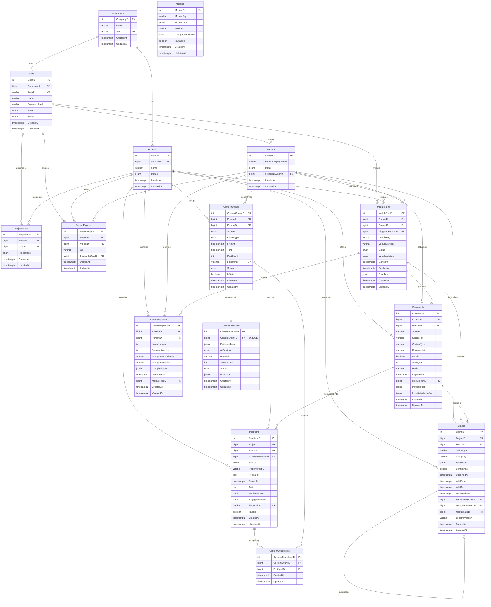

# scaleASAP Database Architecture

This document describes the current database schema for the scaleASAP NestJS backend. The architecture supports a modular data enrichment pipeline where raw data from external sources (LinkedIn, manual uploads) flows through connectors, normalizers, enrichers, and reducers to produce versioned claims about people. All tables use PascalCase column naming and `timestamp with time zone` for temporal fields.

## Table of Contents

- [Entity Relationship Diagram](#entity-relationship-diagram)
- [Enum Catalog](#enum-catalog)
- [Core Data Flow](#core-data-flow)
- [Time & Timezone Rules](#time--timezone-rules)
- [Repository Service Conventions](#repository-service-conventions)

---

## Entity Relationship Diagram



**Key Indexes:**
- `Documents`: IDX_DOCUMENT_LATEST_VALID on (ProjectID, PersonID, Source, DocumentKind, IsValid, CapturedAt)
- `PostItems`: UNIQUE (ProjectID, PersonID, Fingerprint)
- `ContentChunks`: UNIQUE (ProjectID, PersonID, Fingerprint)
- `ContentChunkItems`: UNIQUE (ContentChunkID, PostItemID)
- `ChunkEvidences`: UNIQUE (ContentChunkID) — one evidence per chunk
- `Projects`: Index on (CompanyID, Status)
- `ModuleRuns`: Index on (ProjectID, PersonID, CreatedAt)
- `Claims`: Index on (ProjectID, PersonID, ClaimType, GroupKey, CreatedAt)

---

## Enum Catalog

### EntityStatus
**Values**: ACTIVE, INACTIVE, ARCHIVED  
**Used in**:
- User.Status
- Person.Status

### UserRole
**Values**: ADMIN, MEMBER, VIEWER  
**Used in**:
- User.Role

### ProjectUserRole
**Values**: OWNER, ADMIN, MEMBER, VIEWER  
**Used in**:
- ProjectUser.ProjectRole

### ProjectStatus
**Values**: ACTIVE, ARCHIVED, DELETED  
**Used in**:
- Project.Status

### ModuleType
**Values**: CONNECTOR, ENRICHER, COMPOSER  
**Used in**:
- Module.ModuleType

### ModuleRunStatus
**Values**: QUEUED, RUNNING, COMPLETED, FAILED, CANCELLED  
**Used in**:
- ModuleRun.Status

### DATA_SOURCE
**Values**: LINKEDIN, X, TWITTER, GITHUB, BLOG, OTHER  
**Used in**:
- PostItem.Source
- ContentChunk.Source

### CHUNK_TYPE
**Values**: MONTHLY, BATCH  
**Used in**:
- ContentChunk.ChunkType

### CHUNK_STATUS
**Values**: CREATED, POPULATED, EVIDENCE_READY  
**Used in**:
- ContentChunk.Status

### EVIDENCE_STATUS
**Values**: CREATED, COMPLETED, FAILED  
**Used in**:
- ChunkEvidence.Status

### AI_PROVIDER
**Values**: OPENAI  
**Used in**:
- ChunkEvidence.AIProvider

### AI_MODEL
**Values**: gpt-4o, gpt-4o-mini  
**Used in**: AI service configuration (not directly in entity columns)

### AI_TASK
**Values**: AGE_RANGE_ESTIMATION, ALIAS_INFERENCE, TEXT_SUMMARIZATION, ENTITY_EXTRACTION, EMAIL_PATTERN_INFERENCE, PROFILE_PHOTO_CONFIDENCE_SIGNAL, BIO_EVOLUTION_ANALYSIS, DOMAIN_OWNERSHIP_INFERENCE, POSTS_CHUNK_EVIDENCE_EXTRACTION  
**Used in**: AI service configuration (not directly in entity columns)

### CLAIM_KEY (and ClaimType)
**Values**:
- core_identity.legal_name
- core_identity.location
- core_identity.education_item
- core_identity.career_role
- core_identity.certification
- core_identity.board_position
- core_identity.age_range
- digital_identity.email_pattern
- digital_identity.profile_photo_signal
- digital_identity.bio_evolution
- digital_identity.domain_ownership
- personality.active_times

**Used in**:
- Claim.ClaimType

### DocumentSource
**Values**: MANUAL, LINKEDIN, RESUME, GITHUB, WEB  
**Used in**:
- Document.Source (as string, not enforced enum in entity)

### DocumentKind
**Values**: linkedin_profile, linkedin_posts  
**Used in**:
- Document.DocumentKind (as string, not enforced enum in entity)

---

## Core Data Flow

The scaleASAP system implements a modular data enrichment pipeline with the following stages:

### 1. Module Run Initialization
- User creates a ModuleRun via API (protected by AdminAuthGuard)
- ModuleRun is inserted with Status=QUEUED, assigned to a Project + Person
- ModuleRun.InputConfigJson contains module-specific parameters

### 2. Indexer & Dispatcher
- Background indexer polls ModuleRuns table for QUEUED runs
- Dispatcher routes run to appropriate handler based on ModuleKey
- ModuleRun.Status transitions: QUEUED → RUNNING → COMPLETED/FAILED
- StartedAt and FinishedAt timestamps track execution

### 3. Connector Phase (ModuleType=CONNECTOR)
- Connectors fetch raw data from external sources (LinkedIn, manual uploads)
- Data is stored in Documents table with:
  - IsValid=true for active version
  - CapturedAt timestamp for ordering
  - PayloadJson contains raw JSON payload
  - Hash for deduplication
- When newer data arrives, old document gets IsValid=false
- Query for latest valid: `WHERE IsValid=true ORDER BY CapturedAt DESC`

### 4. Normalizer Phase
- Normalizers parse Documents and extract structured items
- Example: linkedin-posts-normalizer creates PostItems from linkedin_posts Document
- PostItems have unique Fingerprint (SHA256 hash) per Project/Person
- Idempotent: re-running normalizer skips existing Fingerprints

### 5. Chunking Phase (ModuleType=ENRICHER)
- ContentChunker groups PostItems into temporal batches
- CHUNK_TYPE.MONTHLY: groups by UTC month (e.g., "2024-01")
- CHUNK_TYPE.BATCH: all dated posts in one chunk
- ContentChunkItems join table links posts to chunks
- Chunk boundaries (FromAt, ToAt) use UTC timestamps

### 6. Evidence Extraction Phase (ModuleType=ENRICHER)
- AI extractors process each ContentChunk
- One AI call per chunk (no batching)
- Results stored in ChunkEvidence.EvidenceJson
- Status: CREATED → COMPLETED/FAILED
- ErrorJson captures failures
- Metadata: AIProvider, AIModel, TokensUsed

### 7. Reducer Phase (ModuleType=ENRICHER)
- Reducers aggregate ChunkEvidence across multiple chunks
- Produce Claim records with:
  - ClaimType (e.g., 'personality.active_times')
  - ValueJson (structured claim value + metadata)
  - Confidence score
  - SourceDocumentID (latest valid LINKEDIN_POSTS document)

### 8. Claim Versioning
- Claims support versioning via SupersededAt mechanism:
  - Active claims: SupersededAt=NULL
  - Superseded claims: SupersededAt set, ReplacedByClaimID points to new version
- GroupKey identifies which claims supersede each other:
  - 'single' for singleton claims (e.g., legal name)
  - Unique ID for multi-value claims (e.g., education_item_{uuid})
- Query for active claims: `WHERE SupersededAt IS NULL`

### 9. Composer Phase (ModuleType=COMPOSER)
- Composers compile Claims into LayerSnapshots
- LayerNumber indicates abstraction level (1, 2, 3...)
- SnapshotVersion increments with each compilation
- CompiledJson contains final profile representation

---

## Time & Timezone Rules

### UTC Enforcement
All time-based analytics in the scaleASAP system use **UTC** for consistent bucketing across timezones.

### Where UTC is Enforced:
- **Content Chunking**: Monthly chunks use UTC month boundaries via `getUtcMonth()` and `getUtcYear()` helpers
- **Time-of-Day Analytics**: Reducers extract hour-of-day using `getUTCHours()` (not `getHours()`)
- **Day-of-Week Analytics**: Use `getUTCDay()` (not `getDay()`)

### Storing UTC Metadata:
Claims that perform time bucketing MUST include UTC metadata in ValueJson:

```typescript
ValueJson: {
  // ... claim data ...
  _meta: {
    time: {
      basis: 'UTC',
      timezone: 'UTC'
    },
    // ... other metadata ...
  }
}
```

### Timestamp Storage:
- All `timestamp with time zone` columns store UTC instants
- PostItem.PostedAt: UTC timestamp representing when post was published
- ContentChunk.FromAt/ToAt: UTC chunk boundaries
- ModuleRun.StartedAt/FinishedAt: UTC execution times

### Helper Functions:
Time utilities are centralized in `src/common/helpers/time.ts`:
- `getUtcHour(date)` — extract hour 0-23 in UTC
- `getUtcDayOfWeek(date)` — extract day 0-6 in UTC
- `getUtcYear(date)`, `getUtcMonth(date)`, `getUtcDate(date)`
- `getUtcMonthStart(year, month)`, `getUtcMonthEnd(year, month)`
- `formatUtcYearMonth(date)` — format as 'YYYY-MM'

### Data Source Timestamps:
- LinkedIn `posted_at.timestamp` (milliseconds) is used as primary source
- `new Date(timestamp)` creates proper UTC Date object
- Analytics derive UTC buckets from these Date objects

---

## Repository Service Conventions

### CRUD-Only Pattern
All repository services in `src/repo/*-repo.service.ts` are **CRUD-only**:
- `get(options, panic)` — fetch single entity
- `getAll(options, panic)` — fetch multiple entities
- `create(entity)` — insert new row
- `update(where, partial)` — update existing row(s)
- `delete(where)` — delete row(s)
- `count(options)` — count rows

Repository services do NOT contain business logic.

### ResultWithError Pattern
All repo methods return `ResultWithError`:
```typescript
{ data: T | null, error: any }
```

### Promisify Wrapper
Service layer MUST unwrap ResultWithError using Promisify:
```typescript
const document = await Promisify<Document>(
  this.documentRepo.get({ where: { DocumentID: id } }, true)
);
```

Promisify throws on error, returns data on success.

### Logging Convention
All logs MUST use single template-string format (no object second argument):
```typescript
// ✅ Correct
this.logger.info(`Service.method: Message [key=${value}, key2=${value2}]`);

// ❌ Wrong
this.logger.info('Service.method: Message', { key: value });
```

## Repository Service Conventions

### CRUD-Only Pattern
All repository services in `src/repo/*-repo.service.ts` are **CRUD-only**:
- `get(options, panic)` — fetch single entity
- `getAll(options, panic)` — fetch multiple entities
- `create(entity)` — insert new row
- `update(where, partial)` — update existing row(s)
- `delete(where)` — delete row(s)
- `count(options)` — count rows

Repository services do NOT contain business logic.

### ResultWithError Pattern
All repo methods return `ResultWithError`:
```typescript
{ data: T | null, error: any }
```

### Promisify Wrapper
Service layer MUST unwrap ResultWithError using Promisify:
```typescript
const document = await Promisify<Document>(
  this.documentRepo.get({ where: { DocumentID: id } }, true)
);
```

Promisify throws on error, returns data on success.

### Logging Convention
All logs MUST use single template-string format (no object second argument):
```typescript
// ✅ Correct
this.logger.info(`Service.method: Message [key=${value}, key2=${value2}]`);

// ❌ Wrong
this.logger.info('Service.method: Message', { key: value });
```

---

**End of Database Architecture Document**
